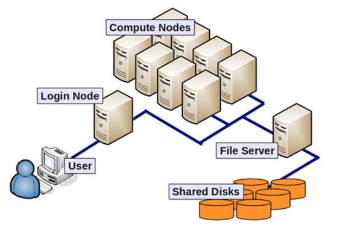
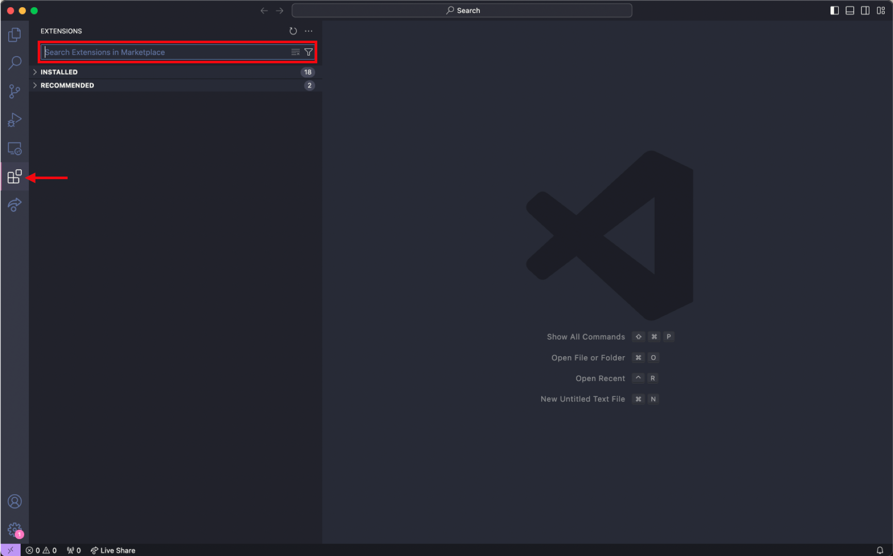
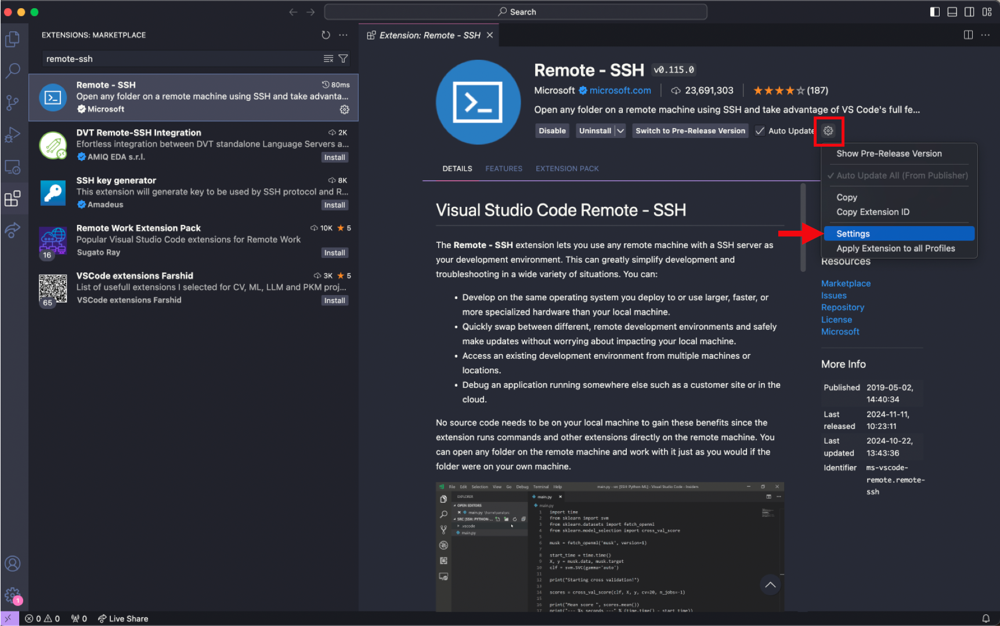
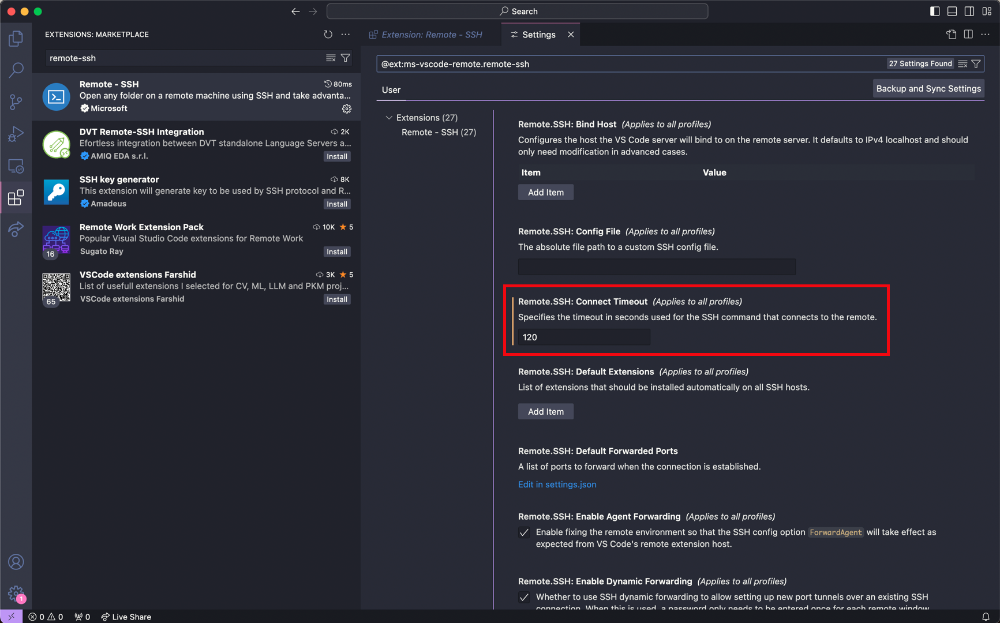
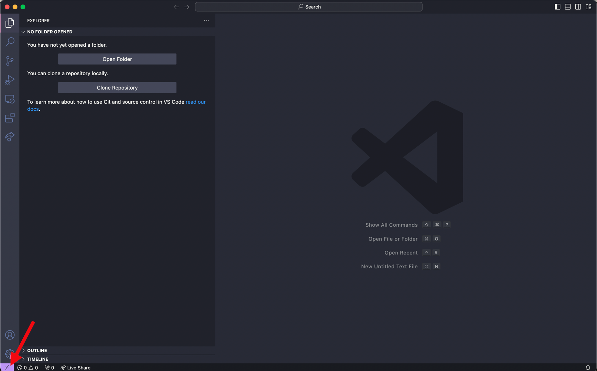
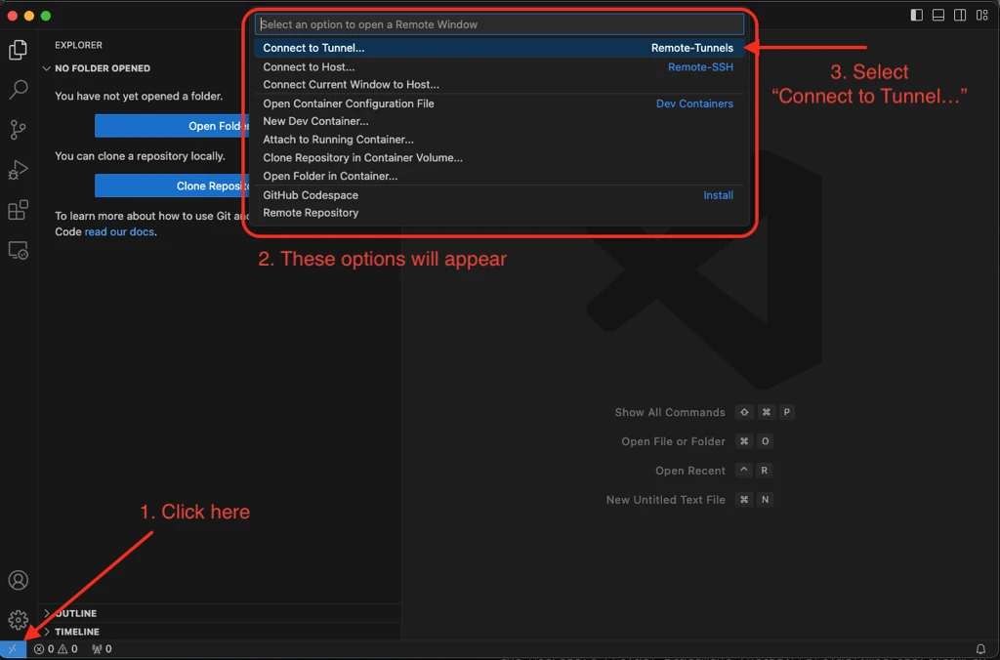
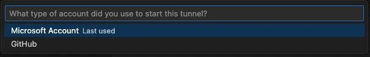

> Instructions for installing various package managers and pipelines

## Compute node

By default upon logging into O2, each user is placed on a login node. Login nodes are NOT suitable for supporting intensive computational processes. Intensive analyses on the login mode will be automatically terminated by O2 and users may be flagged by the admin if this occurs consistently. Please be sure to request a compute node to execute any tasks. For additional details about compute nodes, please reference the [O2 documentation](https://harvardmed.atlassian.net/wiki/spaces/O2/pages/1588665423/O2+HPC+Cluster+and+Computing+Nodes+Hardware).

{width=50%}

This command requests a compute node for 12 hours, with 8GB of memory and 1 core. Compute nodes automatically terminate when you disconnect from the O2 cluster or when the time limit is met, whichever occurs first.

```{python}
#| eval: false
#| echo: true
srun --pty -p priority -t 12:0:0 --mem=8G -c 1 bash
```

## mamba/minimamba

Executing bioinformatics analyses often involve installing multiple packages/tools. Mamba is a package manager that allows users to create environments. Environments separate these package installations into individual "partitions", which helps 1) prevent users from disrupting their own base environment with the installations of these new packages, 2) facilitate easy access and removal of packages and 3) manage/create environments individually for each pipeline or type of analysis.

Install mamba on O2 terminal:

```{python}
#| eval: false
#| echo: true
cd ~;
curl -L -O "https://github.com/conda-forge/miniforge/releases/latest/download/Mambaforge-$(uname)-$(uname -m).sh";
bash Mambaforge-$(uname)-$(uname -m).sh;
```

Initialize mamba on O2 terminal before usage (first time only):

```{python}
#| eval: false
mamba init
# close terminal and reopen
source ~/.bashrc
```

## Snakemake

Snakemake is a package that helps structure and streamline code writing for bioinformatics pipelines, which is particularly useful for complicated pipelines that involve multiple steps and a huge number of files. Create your first conda environment named `snakemake_8_20_3` with the snakemake package installed with the following command.

To read more about snakemake, please refer to the official [Snakemake documentation](https://snakemake.readthedocs.io/en/stable/).

Install snakemake on O2 terminal:

```{python}
#| eval: false
mamba create -n snakemake_8_20_3 -c conda-forge -c bioconda snakemake=8.20.3  snakemake-executor-plugin-slurm  snakemake-executor-plugin-slurm-jobstep
```

To use snakemake, activate this environment maintained by mamba:

```{python}
#| eval: false
mamba activate snakemake_8_20_3
```

## VSCode

VSCode is a code text editor application that provides an easy-to-use interface for viewing and writing code/scripts. This section will detail how to 1) install VSCode as an application on your computer, 2) install VSCode extensions and 3) setup launching VSCode as an interface to view and edit your files on the O2 cluster.

### Install VSCode application
To install VSCode on your computer, use [this link](https://code.visualstudio.com/download).


### Install VSCode extensions
VSCode has a number of extensions that allow each user to customize their own coding experience. We recommend the installation of three extensions:

-   `Rainbow CSV` - identifies "," as the separator in CSV files, highlights each column with a different color

-   `VSCode-pdf` - view PDF files directly within the VSCode interface

-   `Remote-SSH` - allows users to login and access their own HPC cluster and view their files through the VSCode interface (see next section)


To install extensions:

1. Navigate to the toolbar on the far left of the VSCode interface and click on the icon that resembles four squares. 
2. Use the search bar that has the caption "Search Extensions in Marketplace" to find extensions that you like and install each of them individually.
3. An additional step for `Remote-SSH` installation involves changing the connect timeout setting. As O2 login requires Duo authentication, there is often a slight delay and more time is needed to complete the authentication and login properly. To adjust this, please follow steps 4-6. 

4. Navigate to the extension page for `Remote-SSH` (on the toolbar on the far left, select the icon with four squares, then input remote-ssh into the search bar) {width="90%"}\

5.  Select the gear button and press Settings {width="90%"}\

6.  Input 120 seconds for the `Remote.SSH: Connect Timeout` parameter {width="90%"}\

### Setup O2 access with VSCode: Launch VSCode on O2 login node

While logging into O2 on the terminal only provides a command-line interface and linux commands are needed to modify files, the main advantage of accessing O2 through VSCode is it allows users to easily view and edit their files in an interactive manner within the VSCode application.

After installation of VSCode and the Remote-SSH extension, establish a SSH connection to O2 through VSCode:

1.  Press the bottom left purple icon to 'Open a Remote Window'. This will prompt a few options to be displayed at the top near the search bar {width="90%"}

2.  Select 'Add New SSH Host' and then input the following and enter

```{python}
#| eval: false
<hms_id>@o2.hms.harvard.edu
```

3.  Select `<path to config>/.ssh/config` as the SSH configuration file to update
4.  Input password for O2 login
5.  Complete Duo authentication
6.  Login complete (Note: login may take longer at the first instance because VSCode will download its own server.)

After setup, directly click the bottom left purple icon each time and input login credentials to launch O2 on VSCode each time. 

### Setup O2 access with VSCode: Launch VSCode on O2 compute node

After setting up VSCode, Remote-SSH extension and establishing a connection to O2 login node through VSCode, follow these steps to launch VSCode on a compute node in O2. This is useful if you plan to use VSCode to open or edit larger files as this may be a process that is too computationally intensive for login nodes to handle, leading the O2 cluster to automatically terminate your connection to O2 through VSCode. For a more detailed description, please refer to the [official O2 documentation on VSCode](https://harvardmed.atlassian.net/wiki/spaces/O2/pages/2051211265/VSCode+and+Code+Server+on+O2), which was used as a reference for this section.

1.  Generate SSH key on your own computer's terminal with the following command. When prompted for file name, press enter to use the default file name. Enter a passphrase to protect your SSH keys.

```{python}
#| eval: false
# input this line into your computer's terminal
ssh-keygen -t rsa

# sample output (See O2 documentation for reference)
Generating public/private rsa key pair.
Enter file in which to save the key (/USERHOME/.ssh/id_rsa):
Enter passphrase (empty for no passphrase):
Enter same passphrase again:
Your identification has been saved in /USERHOME/.ssh/id_rsa.
Your public key has been saved in /USERHOME/.ssh/id_rsa.pub.
The key fingerprint is:
a5:b5:38:73:b7:3c:a6:8a:1d:a8:bd:87:4e:be:33:21 
```

2.  Copy your computer's SSH public key onto the O2 SSH authorized_keys file, which allows your computer and O2 to recognize each other

- Linux or Mac:
```{python}
#| eval: false
# input this line into your computer's terminal
ssh-copy-id -i $HOME/.ssh/id_rsa.pub <hms_id>@o2.hms.harvard.edu
# input O2 password and complete Duo authentication
```

- Windows:
```{python}
#| eval: false
# input this line into your computer's terminal
Get-Content "$env:USERPROFILE\.ssh\id_rsa.pub" | ssh <hms_id>@o2.hms.harvard.edu "mkdir -p ~/.ssh && cat >> ~/.ssh/authorized_keys"
# input O2 password and complete Duo authentication
```

3.  Add new lines in your computer's SSH config file. Replace HMS ID with your own ID. After modification, use `Ctrl + X` followed by enter to save the file.

```{python}
#| eval: false
# input this line into your computer's terminal
# open your computer's SSH config file
nano ~/.ssh/config

#for Windows systems use
notepad $env:USERPROFILE\.ssh\config

# copy and paste the following lines into the config file
Host o2jump
  HostName o2.hms.harvard.edu
  User <hms_id>
  ForwardAgent yes
  ForwardX11 yes
  ForwardX11Trusted yes

Host o2job
  HostName compute_node_of_job
  User <hms_id>
  ProxyJump o2jump
  ForwardAgent yes
```

4. Request a compute node on O2, update your local config file with the node information for VSCode with the following command. Please use the command appropriate for your operating system, as the syntax varies slightly. Your requested compute node will be allocated with a 1 hour runtime, 4GB memory and 1 core. 

- Linux:
```{python}
#| eval: false
# input this line into your computer's terminal
ssh <hms_id>@o2.hms.harvard.edu "/n/groups/kwon/joseph/submit_o2.sh" | tail -n 1 | xargs -I {} sed -i "/^Host o2job$/,/^\s*Host /{s/^\(\s*HostName\s*\).*$/\1{}/}" ~/.ssh/config
```

- Mac: 
```{python}
#| eval: false
# input this line into your computer's terminal
ssh <hms_id>@o2.hms.harvard.edu "/n/groups/kwon/joseph/submit_o2.sh" | tail -n 1 | xargs -I {} | xargs -I NODE_HOSTNAME sed -i '' "/^Host o2job$/,/^[[:space:]]*Host / s/^\([[:space:]]*HostName[[:space:]]*\).*/\1NODE_HOSTNAME/" ~/.ssh/config
```

- Windows:
```{python}
#| eval: false
# input this line into your computer's terminal
$nodeHostname = (ssh <hms_id>@o2.hms.harvard.edu "/n/groups/kwon/joseph/submit_o2.sh" | Select-Object -Last 1); (Get-Content "$env:USERPROFILE\.ssh\config") | ForEach-Object { if ($_ -match 'Host o2job') { $_; $foundJob = $true } elseif ($foundJob -and $_ -match '^\s*HostName\s+') { $foundJob = $false; $_ -replace '(?<=HostName\s*)\S+', $nodeHostname } else { $_ } } | Set-Content "$env:USERPROFILE\.ssh\config"
```


5. Open VSCode, select the bottom left purple icon to launch the remote connection. Select 'Connect to Host' and `o2job` as the server. Proceed by inputting O2 login password and completing Duo authentication. Select 'Continue' to proceed. 

Setup for launching VSCode on a O2 compute node is now complete. After setup, it is only necessary to execute Steps 4-5 each time to launch this.


### Navigate to your O2 directory in VSCode 
Following launching VSCode on either an O2 login or a compute node, navigate to your own O2 directory:

1. Navigate to the top bar in VSCode and press File > Open Folder
2. Type in path (e.g. `/n/groups/kwon/<your name>`)
3. Begin to edit and view files in directory

### Use a VS Code tunnel to access an O2 compute node (recommended)

A VS Code [tunnel](https://code.visualstudio.com/docs/remote/tunnels) is generally more reliable than Remote-SSH for working on a compute node: the connection survives closing your laptop lid or losing wifi and reconnects automatically, and once it's running you connect straight to your compute node without proxy-jumping through the login node each time. The following steps are adapted from the [official O2 documentation on VS Code Remote Tunnel using sbatch](https://harvardmed.atlassian.net/wiki/spaces/O2/pages/3464822792/VS+Code+Remote+Tunnel+using+sbatch).

1. Make sure you already have a scratch directory (see [Making a scratch directory](../o2/index.qmd#making-a-scratch-directory)). If you're not sure, run the following on O2 — it's safe to run again even if you already have one:

   ```bash
   /n/cluster/bin/scratch_create_directory.sh
   ```

2. Copy the job script for the VS Code tunnel to your home directory:

   ```bash
   cp /n/groups/kwon/xin/vscode.sh ~
   ```

   This script requests a compute node via `sbatch` and launches a VS Code tunnel on it once the job starts running. It should look like this:

   ```bash
   #!/bin/bash
   #SBATCH -p priority     # Change to desired partition
   #SBATCH --mem=1g        # Change to desired RAM
   #SBATCH --time=08:00:00 # Change to desired wall-time
   #SBATCH -c 1            # Change to desired CPU cores
   #SBATCH -o vscode.out   # Output file name

   set -o errexit -o nounset -o pipefail
   MY_SCRATCH="/n/scratch/users/${USER:0:1}/${USER}/vscode"
   mkdir -p $MY_SCRATCH
   echo $MY_SCRATCH

   # If not done yet, download the VS Code CLI tarball into $MY_SCRATCH
   if [ -e "$MY_SCRATCH/code" ]; then
       echo "using $MY_SCRATCH/code"
   else
       echo "install a new version of code"
       curl -Lk 'https://code.visualstudio.com/sha/download?build=stable&os=cli-alpine-x64' | tar -C $MY_SCRATCH -xzf -
   fi

   # Sign in with the provider of your choice (leave only one of the two lines below uncommented)
   $MY_SCRATCH/code tunnel user login --provider microsoft
   #$MY_SCRATCH/code tunnel user login --provider github

   # Accept the license terms & launch the tunnel
   $MY_SCRATCH/code tunnel --accept-server-license-terms --name o2tunnel
   ```

   `--time` controls how long the tunnel stays up (8 hours by default); the tunnel dies when the job ends, at which point you'll need to resubmit the job and reconnect. Increase it if you need a longer session.

3. Submit the job:

   ```bash
   sbatch ~/vscode.sh
   ```

4. Check the job status, and once it's running, get the sign-in link from the job's output file:

   ```bash
   squeue | grep <hms_id>
   # status column shows 'PD' while pending; rerun this until it shows 'R' for running

   cat ~/vscode.out
   # once running, this prints a line like:
   # To sign in, use a web browser to open the page https://login.microsoft.com/device and enter the code [CODE] to authenticate.
   ```

5. Open the link printed in `vscode.out` (e.g. `https://login.microsoft.com/device`) in a browser, enter the code shown, and sign in with the account for the provider you chose in step 2 (Microsoft or GitHub).

6. Connect from your local VS Code:

   a. Install the **Remote - Tunnels** extension (`ms-vscode.remote-server`) — only needed once.

   b. Open the VS Code Accounts menu and choose "Turn on Remote Tunnel Access".

   c. Click the bottom-left remote-connection icon, then select "Connect to Tunnel…" from the options that appear at the top.

      {width=70%}

   d. Choose the same provider (Microsoft or GitHub) you signed in with in step 5.

      {width=70%}

   e. Open the Remote Explorer icon and, under the Tunnels section, select the tunnel name you gave the job (`o2tunnel` in the script above) to connect — either in the current window or a new one. Before clicking, confirm you see `Remote -> Tunnels -> o2tunnel` listed as running.

Once connected, any terminal you open in VS Code runs on the compute node where your job is executing.