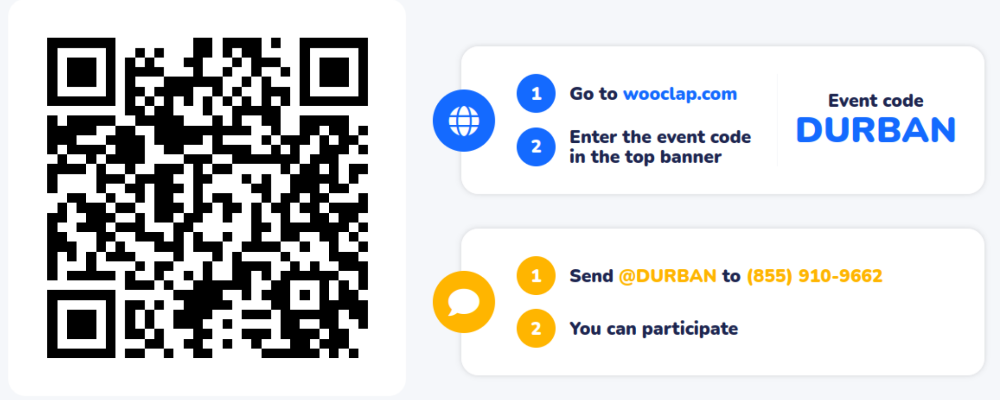

<!-- Reusable Wooclap poll slide body, included at each poll checkpoint in
     slides.qmd. Reuses the Durban workshop's Wooclap event (code DURBAN) and QR.
     The questions themselves live in Wooclap. -->

Go to **[wooclap.com](https://app.wooclap.com/DURBAN?from=event-page)** and enter event code **DURBAN** — or scan:

{width=760 fig-alt="Wooclap QR code and instructions, event code DURBAN"}
