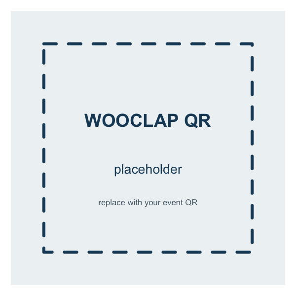

<!-- Reusable Wooclap poll slide body. Included at each poll checkpoint in
     slides.qmd. INSTRUCTOR TODO: (1) replace images/wooclap_qr.png with your
     RISE Wooclap QR code — the same event as last time — and (2) set the real
     event URL in the link below. The questions themselves live in Wooclap. -->

Go to **[the Wooclap poll](https://www.wooclap.com/)** — or scan the code:

{width=300 fig-alt="QR code linking to the Wooclap poll"}
