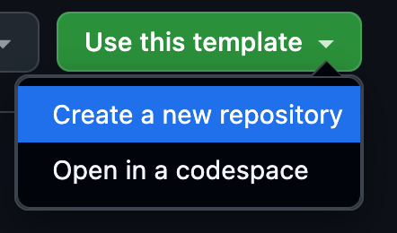
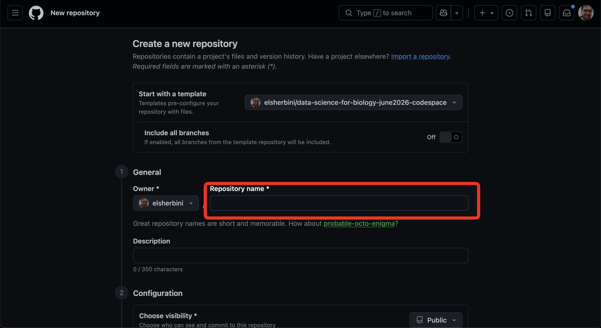
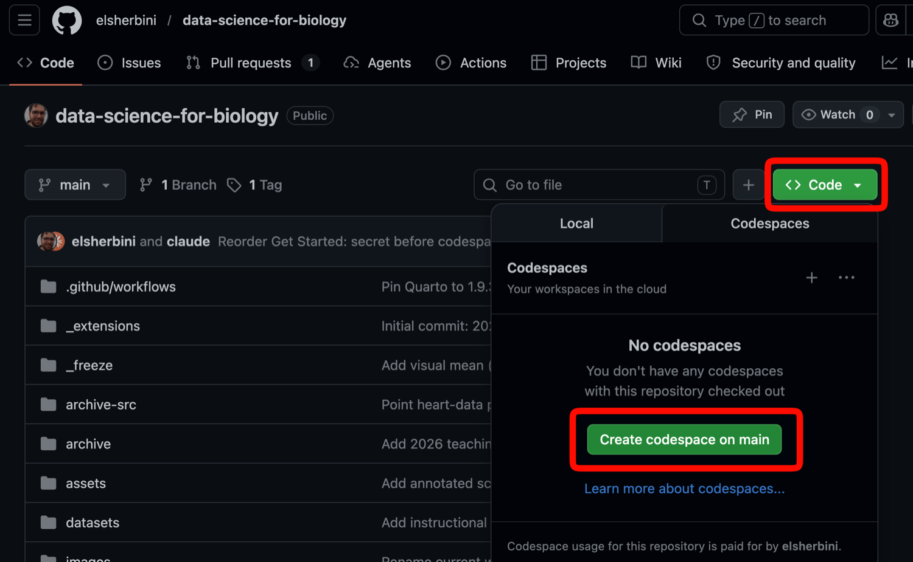

> A 2-hour, hands-on introduction to making plots in R with `ggplot2`, using
> the Palmer Penguins dataset. For RISE 2026 summer researchers — no prior R
> needed.

## Set up your environment

Everything runs in the cloud with **GitHub Codespaces** — there is nothing to
install on your laptop. You only need a web browser and a free GitHub account.
No API keys, no setup beyond the four steps below.

### 1. Sign in to GitHub

Go to [github.com/login](https://github.com/login) and sign in, or
[create a free account](https://github.com/signup) if you don't have one.

This matters because GitHub hides the **"Use this template"** and **"Code"**
buttons from signed-out visitors — if you're not logged in, the buttons in the
next steps won't appear.

### 2. Make your own copy of the environment

Open the [participant environment repo](https://github.com/kwondry/r-tutorial-rise-2026)
and click the green **"Use this template"** button near the top right, then
choose **"Create a new repository"**.

{.img-fluid fig-alt="GitHub repo page with the 'Use this template' button highlighted in the top right"}

{.img-fluid fig-alt="Use this template dropdown with 'Create a new repository' highlighted"}

Give the repository a name (for example, `rise-data-viz`) and click the green
**"Create repository"** button. The owner can stay as your username.

{.img-fluid fig-alt="New repository form with the Repository name field highlighted"}

### 3. Launch your codespace

Go to your new repository's page. Click the green **"Code"** button, switch to
the **"Codespaces"** tab, and click **"Create codespace on main"**.

{.img-fluid fig-alt="Repository page with the Code button and Create codespace on main button highlighted in the Codespaces tab"}

The first build takes **a few minutes** while GitHub sets up R, the tidyverse,
and Quarto for you. After this first build, reopening the codespace is fast.

### 4. Open the first notebook

Once the codespace has finished building:

1. In the file explorer on the left, open `notebooks/00-hello.qmd`.
2. Click the green **play button** on the code cell. A penguin chart should
   appear — that means your environment is working and you are ready.
3. When we start the session, open `notebooks/01-visualization.qmd` and work
   through it with the class.

If you get stuck, ask an instructor.

## Slides

[Open the slides full screen](slides.qmd)

```{=html}
<iframe class="slide-deck" src="slides.html" height="420" width="747" style="border: 1px solid #2e3846;"></iframe>
```

## The datasets

Most of today uses `palmerpenguins`: measurements of 344 penguins from three
species (Adelie, Chinstrap, Gentoo) across three islands. Each **row** is one
penguin; each **column** is something measured about it (flipper length, body
mass, species, island, …).

In the last part we switch to a small **plate-reader** result — four genes
measured in ten samples — to see what real machine data looks like and how to
reshape it for plotting.

The session runs in three short cycles of *learn a little, then try it*:

- **Part A** — the elements of a plot: geom, mark, mapping
- **Part B** — distributions: histograms and boxplots
- **Part C** — tidy data: reshaping wide machine data with `pivot_longer()`


